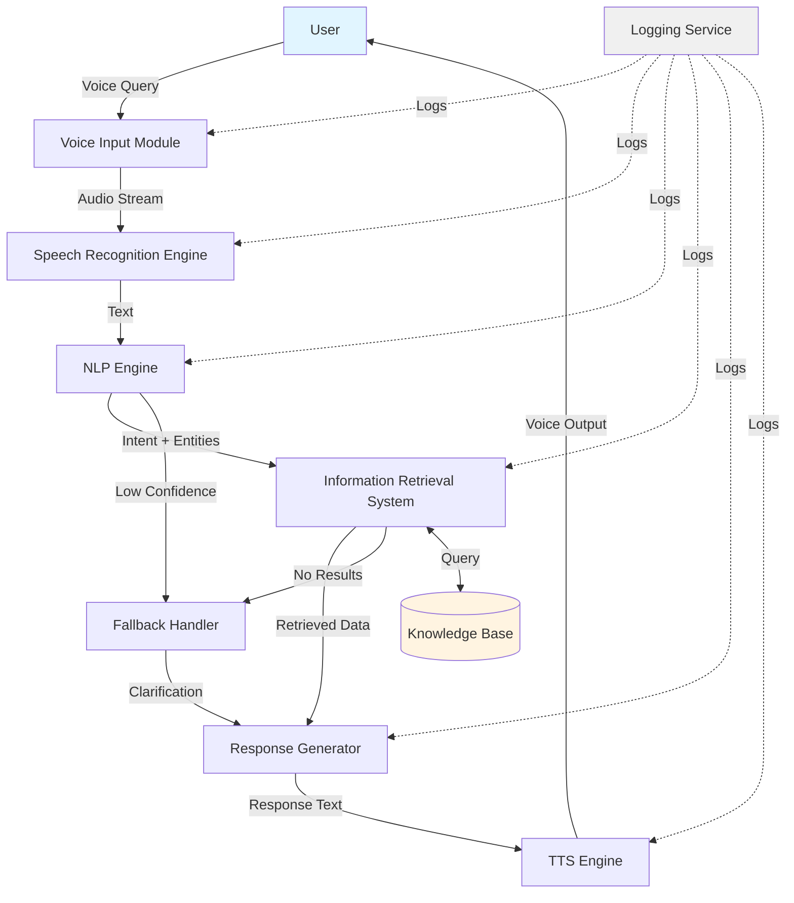
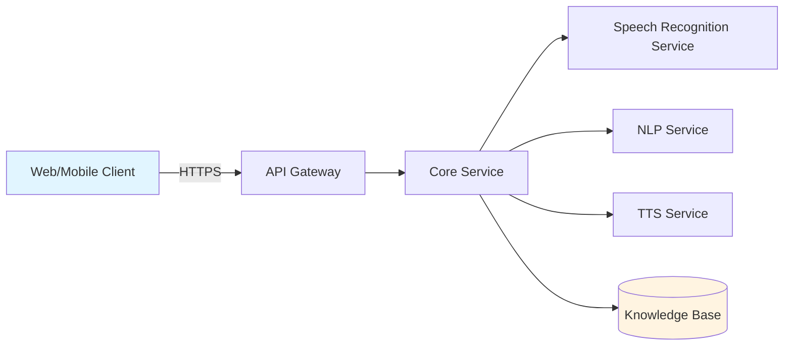

# Design Document: YojanaSetu

## Overview

YojanaSetu is a voice-enabled AI assistant that provides accessible information about government schemes, education, healthcare, and employment opportunities to Indian citizens with low digital literacy. The system employs a modular pipeline architecture that processes voice queries through six main stages: voice capture, speech-to-text conversion, natural language understanding, information retrieval, response generation, and text-to-speech output.

The design prioritizes simplicity, modularity, and rapid prototyping suitable for a hackathon timeline while maintaining scalability for future enhancements. The architecture leverages existing open-source libraries and cloud services to minimize development effort while ensuring multi-language support and privacy-first data handling.

## Architecture

### High-Level Architecture

The system follows a pipeline architecture with six core components that process user queries sequentially:

```
User Voice Input → Voice Input Module → Speech Recognition Engine → 
NLP Engine → Information Retrieval System → Response Generator → 
TTS Engine → Voice Output
```

### Component Diagram



### Deployment Architecture

For the hackathon prototype, we'll use a simplified deployment:



**Deployment Strategy:**
- Single server deployment for prototype (can scale horizontally later)
- API Gateway handles HTTPS termination and rate limiting
- Core Service orchestrates the pipeline
- External services for ASR and TTS (Google Cloud Speech/TTS or Azure)
- Local NLP processing using lightweight models
- SQLite or PostgreSQL for Knowledge Base

## Components and Interfaces

### 1. Voice Input Module

**Responsibility:** Capture audio input from user's microphone and prepare it for speech recognition.

**Interface:**
```python
class VoiceInputModule:
    def start_recording() -> AudioStream
    def stop_recording() -> AudioBuffer
    def get_audio_format() -> AudioFormat
    def validate_audio_quality(audio: AudioBuffer) -> bool
```

**Implementation Details:**
- Use Web Audio API for browser-based clients
- Use native audio APIs for mobile apps
- Audio format: 16kHz, 16-bit, mono PCM
- Maximum recording duration: 30 seconds
- Automatic silence detection to stop recording
- Basic noise filtering using high-pass filter

**Technology Choices:**
- Browser: Web Audio API with MediaRecorder
- Mobile: React Native Audio or native APIs
- Audio processing: librosa (Python) or Web Audio API

### 2. Speech Recognition Engine

**Responsibility:** Convert audio input to text in multiple Indian languages.

**Interface:**
```python
class SpeechRecognitionEngine:
    def transcribe(audio: AudioBuffer, language: str) -> TranscriptionResult
    def get_supported_languages() -> List[str]
    def set_language_model(language: str) -> None
```

**Data Structures:**
```python
class TranscriptionResult:
    text: str
    confidence: float  # 0.0 to 1.0
    language: str
    alternatives: List[str]  # Alternative transcriptions
```

**Implementation Details:**
- Primary: Google Cloud Speech-to-Text API (supports Indian languages)
- Fallback: Azure Speech Services
- Supported languages: English (en-IN), Hindi (hi-IN), Tamil (ta-IN), Telugu (te-IN), Bengali (bn-IN)
- Streaming recognition for real-time feedback
- Language auto-detection if user doesn't specify
- Confidence threshold: 0.6 (below this triggers fallback)

**Design Decision:** We're using cloud services rather than local models because:
1. Indian language ASR models require significant resources
2. Cloud services provide better accuracy for regional languages
3. Faster development time for hackathon
4. Can switch to local models later for privacy if needed

### 3. NLP Engine

**Responsibility:** Understand user intent and extract relevant entities from transcribed text.

**Interface:**
```python
class NLPEngine:
    def detect_intent(text: str, language: str) -> IntentResult
    def extract_entities(text: str, language: str) -> List[Entity]
    def classify_domain(text: str) -> Domain
```

**Data Structures:**
```python
class IntentResult:
    intent: str  # e.g., "find_scheme", "check_eligibility", "get_info"
    confidence: float
    domain: Domain  # SCHEMES, EDUCATION, HEALTHCARE, JOBS
    entities: List[Entity]

class Entity:
    type: str  # e.g., "location", "age", "occupation", "scheme_name"
    value: str
    confidence: float

enum Domain:
    SCHEMES
    EDUCATION
    HEALTHCARE
    JOBS
    GENERAL
```

**Implementation Details:**
- Use lightweight transformer model (DistilBERT or MiniLM) fine-tuned for Indian context
- Intent classification: Multi-class classifier with 15-20 common intents
- Entity extraction: Named Entity Recognition (NER) for locations, demographics, scheme names
- Multilingual support using mBERT or IndicBERT for Indian languages
- Fallback to keyword matching for low-resource languages

**Intent Categories:**
- Scheme-related: find_scheme, check_eligibility, scheme_details, application_process
- Education: find_courses, scholarship_info, admission_info
- Healthcare: find_hospital, health_scheme, medical_assistance
- Jobs: find_jobs, skill_training, employment_scheme
- General: greeting, help, clarification

**Design Decision:** Using a lightweight model instead of large LLMs because:
1. Faster inference (< 500ms requirement)
2. Can run locally without expensive GPU
3. Sufficient for intent classification task
4. Lower operational costs

### 4. Information Retrieval System

**Responsibility:** Fetch relevant information from the knowledge base based on detected intent and entities.

**Interface:**
```python
class InformationRetrievalSystem:
    def query(intent: IntentResult) -> List[InformationItem]
    def rank_results(items: List[InformationItem], entities: List[Entity]) -> List[InformationItem]
    def filter_by_eligibility(items: List[InformationItem], user_context: UserContext) -> List[InformationItem]
```

**Data Structures:**
```python
class InformationItem:
    id: str
    title: str
    description: str
    domain: Domain
    details: Dict[str, Any]
    eligibility_criteria: List[str]
    source_url: str
    last_updated: datetime

class UserContext:
    location: Optional[str]
    age: Optional[int]
    occupation: Optional[str]
    language: str
```

**Implementation Details:**
- Vector database for semantic search (ChromaDB or FAISS)
- Keyword-based search as fallback
- Ranking algorithm combines:
  - Semantic similarity (60% weight)
  - Entity match score (30% weight)
  - Recency of information (10% weight)
- Maximum 5 results returned
- Eligibility filtering based on extracted entities

**Knowledge Base Schema:**
```sql
CREATE TABLE schemes (
    id TEXT PRIMARY KEY,
    name TEXT NOT NULL,
    description TEXT,
    domain TEXT,
    eligibility TEXT,
    benefits TEXT,
    application_process TEXT,
    contact_info TEXT,
    state TEXT,
    embedding VECTOR(384)
);

CREATE TABLE education (
    id TEXT PRIMARY KEY,
    program_name TEXT,
    institution TEXT,
    description TEXT,
    eligibility TEXT,
    location TEXT,
    embedding VECTOR(384)
);

-- Similar tables for healthcare and jobs
```

**Design Decision:** Using vector embeddings for semantic search because:
1. Handles informal queries better than keyword search
2. Works across languages with multilingual embeddings
3. Finds relevant results even with incomplete information
4. Relatively simple to implement with existing libraries

### 5. Response Generator

**Responsibility:** Create natural, simple language responses from retrieved information.

**Interface:**
```python
class ResponseGenerator:
    def generate(items: List[InformationItem], intent: IntentResult, language: str) -> str
    def simplify_language(text: str, language: str) -> str
    def format_for_voice(text: str) -> str
```

**Implementation Details:**
- Template-based generation for common intents (fast, predictable)
- LLM-based generation for complex queries (GPT-3.5 or local Llama model)
- Language simplification rules:
  - Replace jargon with common words
  - Use short sentences (< 15 words)
  - Active voice only
  - Concrete examples over abstract concepts
- Response structure:
  1. Direct answer (1-2 sentences)
  2. Key details (2-3 points)
  3. Next steps (1 sentence)

**Template Example:**
```python
SCHEME_INFO_TEMPLATE = {
    "hi": "{scheme_name} एक सरकारी योजना है जो {benefit} प्रदान करती है। "
          "यह {eligibility} के लिए है। आवेदन करने के लिए {process}।",
    "en": "{scheme_name} is a government scheme that provides {benefit}. "
          "It is for {eligibility}. To apply, {process}."
}
```

**Design Decision:** Hybrid approach (templates + LLM) because:
1. Templates ensure consistent, simple language for common queries
2. LLM handles edge cases and complex questions
3. Faster response time with templates
4. Cost-effective for high-volume queries

### 6. TTS Engine

**Responsibility:** Convert text responses to natural-sounding speech in user's language.

**Interface:**
```python
class TTSEngine:
    def synthesize(text: str, language: str, voice: str) -> AudioBuffer
    def get_available_voices(language: str) -> List[Voice]
    def set_speech_rate(rate: float) -> None
```

**Data Structures:**
```python
class Voice:
    id: str
    language: str
    gender: str
    name: str
    sample_rate: int
```

**Implementation Details:**
- Primary: Google Cloud Text-to-Speech (best quality for Indian languages)
- Fallback: Azure TTS or gTTS (Google Text-to-Speech library)
- Voice selection: Female voices (generally preferred for assistive tech)
- Speech rate: 0.9x (slightly slower for clarity)
- Audio format: MP3 or WAV, 24kHz
- Caching: Cache common responses to reduce API calls

**Supported Voices:**
- Hindi: hi-IN-Wavenet-A (female)
- Tamil: ta-IN-Wavenet-A (female)
- Telugu: te-IN-Standard-A (female)
- Bengali: bn-IN-Wavenet-A (female)
- English: en-IN-Wavenet-D (female)

**Design Decision:** Using cloud TTS because:
1. High-quality, natural voices for Indian languages
2. Local TTS models for Indian languages are limited
3. Acceptable latency (< 500ms)
4. Can cache responses for common queries

### 7. Fallback Handler

**Responsibility:** Manage unclear queries and guide users when system confidence is low.

**Interface:**
```python
class FallbackHandler:
    def handle_low_confidence(intent: IntentResult, language: str) -> str
    def generate_clarification(intent: IntentResult, language: str) -> str
    def suggest_alternatives(query: str, language: str) -> List[str]
    def get_example_queries(domain: Domain, language: str) -> List[str]
```

**Implementation Details:**
- Confidence thresholds:
  - High: > 0.7 (proceed normally)
  - Medium: 0.5-0.7 (ask for confirmation)
  - Low: < 0.5 (ask for clarification)
- Clarification strategies:
  1. Repeat what was understood
  2. Ask yes/no question
  3. Provide examples
  4. Offer domain selection
- Maximum 2 clarification attempts
- After 2 failed attempts, offer contact information for human assistance

**Clarification Templates:**
```python
CLARIFICATION_TEMPLATES = {
    "hi": "क्या आप {domain} के बारे में जानकारी चाहते हैं? कृपया हाँ या ना कहें।",
    "en": "Do you want information about {domain}? Please say yes or no."
}

EXAMPLE_QUERIES = {
    "schemes": {
        "hi": ["प्रधानमंत्री आवास योजना क्या है?", "मुझे किसान योजना चाहिए"],
        "en": ["What is PM housing scheme?", "I need farmer scheme"]
    }
}
```

### 8. Logging Service

**Responsibility:** Track system behavior, errors, and performance metrics.

**Interface:**
```python
class LoggingService:
    def log_query(query_id: str, metadata: Dict) -> None
    def log_error(component: str, error: Exception, context: Dict) -> None
    def log_performance(component: str, duration: float) -> None
    def get_metrics(time_range: TimeRange) -> Metrics
```

**Logged Information:**
- Query metadata: timestamp, language, domain, intent (NO voice data)
- Performance: component latency, end-to-end time
- Errors: component name, error type, stack trace
- Usage: queries per hour, language distribution, domain distribution

**Privacy Considerations:**
- NO voice recordings stored
- NO transcribed text stored (only anonymized metadata)
- Query IDs are random UUIDs (not linked to users)
- Logs retained for 30 days only

## Data Models

### Query Processing Flow

```python
class QuerySession:
    session_id: str
    timestamp: datetime
    language: str
    audio_duration: float
    transcription: str
    intent: IntentResult
    retrieved_items: List[InformationItem]
    response: str
    total_duration: float
    status: str  # "success", "fallback", "error"
```

### Knowledge Base Entry

```python
class SchemeEntry:
    id: str
    name: str
    name_translations: Dict[str, str]  # {language: translated_name}
    description: str
    description_translations: Dict[str, str]
    domain: Domain
    eligibility: List[EligibilityCriterion]
    benefits: List[str]
    application_process: str
    required_documents: List[str]
    contact_info: ContactInfo
    state: Optional[str]
    central_scheme: bool
    last_updated: datetime
    source_url: str

class EligibilityCriterion:
    criterion_type: str  # "age", "income", "occupation", "location"
    operator: str  # ">=", "<=", "==", "in"
    value: Any
    description: str
```

### Configuration

```python
class SystemConfig:
    supported_languages: List[str]
    asr_service: str  # "google", "azure"
    tts_service: str  # "google", "azure"
    nlp_model: str
    max_query_duration: int  # seconds
    response_timeout: int  # seconds
    confidence_thresholds: Dict[str, float]
    api_keys: Dict[str, str]
```

## Correctness Properties

*A property is a characteristic or behavior that should hold true across all valid executions of a system—essentially, a formal statement about what the system should do. Properties serve as the bridge between human-readable specifications and machine-verifiable correctness guarantees.*


### Property 1: End-to-End Response Time

*For any* valid voice query, the complete processing pipeline from voice input to voice output should complete within 3 seconds under normal load conditions.

**Validates: Requirements 8.1, 2.1, 3.1, 4.4, 5.1, 6.1**

### Property 2: Multi-Language Support Consistency

*For any* supported language (English, Hindi, Tamil, Telugu, Bengali), the system should successfully process voice input, detect intent, retrieve information, generate response, and produce voice output with equivalent accuracy and functionality.

**Validates: Requirements 12.1, 1.4, 2.2, 6.2, 3.6, 12.3**

### Property 3: Audio Input Robustness

*For any* valid audio input with background noise within reasonable limits (SNR > 10dB), the Voice_Input_Module should successfully capture and process the audio without rejection or failure.

**Validates: Requirements 1.1, 1.3**

### Property 4: Component Data Flow Integrity

*For any* query, when the Speech_Recognition_Engine completes transcription, the resulting text should be successfully passed to the NLP_Engine, and when NLP_Engine completes intent detection, the result should be passed to the Information_Retrieval_System.

**Validates: Requirements 2.3, 4.1**

### Property 5: Informal Speech Handling

*For any* informal or incomplete speech input (missing articles, grammatical errors, colloquialisms), the system should produce a transcription and attempt intent detection without crashing or rejecting the input.

**Validates: Requirements 2.4**

### Property 6: Confidence-Based Fallback Routing

*For any* query where transcription confidence is below 60% or intent confidence is below 50%, the system should trigger the Fallback_Handler and generate an appropriate clarification question.

**Validates: Requirements 2.5, 3.5, 7.1**

### Property 7: Multi-Intent Prioritization

*For any* query containing multiple detectable intents, the NLP_Engine should select exactly one primary intent with the highest confidence score.

**Validates: Requirements 3.3**

### Property 8: Entity Extraction Completeness

*For any* query containing entities (location, age, occupation, scheme names), the NLP_Engine should extract all present entities with their types and values.

**Validates: Requirements 3.4**

### Property 9: Result Ranking by Relevance

*For any* query that returns multiple information items, the Information_Retrieval_System should rank them such that items with higher semantic similarity and entity match scores appear before items with lower scores.

**Validates: Requirements 4.3**

### Property 10: No-Results Fallback Trigger

*For any* query where no relevant information is found in the Knowledge_Base, the Information_Retrieval_System should return a no-results indicator that triggers the Fallback_Handler.

**Validates: Requirements 4.5**

### Property 11: Entity-Based Filtering

*For any* query with extracted entities (location, demographics), the Information_Retrieval_System should return only results that match or are compatible with those entities.

**Validates: Requirements 4.6**

### Property 12: Response Language Simplicity

*For any* generated response, the text should have a Flesch-Kincaid reading ease score above 60 (indicating 8th-grade level or simpler) and contain no words from a predefined jargon list.

**Validates: Requirements 5.2, 5.3**

### Property 13: Response Structure Clarity

*For any* generated response, sentences should be no longer than 20 words, and the total response should follow the structure: direct answer, key details, next steps.

**Validates: Requirements 5.4, 5.7**

### Property 14: Response Relevance Prioritization

*For any* response generated from multiple information items, the most relevant item (highest similarity score) should be mentioned first in the response text.

**Validates: Requirements 5.5**

### Property 15: Response Language Consistency

*For any* query in language L, the generated response should be in the same language L, verified by language detection on the response text.

**Validates: Requirements 5.6**

### Property 16: TTS Audio Quality Consistency

*For any* supported language, the TTS_Engine should generate audio with consistent sample rate (24kHz) and format (MP3 or WAV) regardless of input text content.

**Validates: Requirements 6.4**

### Property 17: TTS Retry on Failure

*For any* TTS conversion failure, the TTS_Engine should attempt exactly one retry before returning an error notification.

**Validates: Requirements 6.5**

### Property 18: Fallback Example Provision

*For any* fallback scenario (low confidence or no results), the Fallback_Handler should include at least two example queries in the user's language to guide them.

**Validates: Requirements 7.2**

### Property 19: Fallback Alternative Suggestions

*For any* no-results scenario, the Fallback_Handler should suggest at least one related topic or alternative query based on the original query's domain.

**Validates: Requirements 7.3**

### Property 20: Clarification Attempt Limit

*For any* conversation session, the Fallback_Handler should allow a maximum of two clarification attempts before offering human assistance contact information.

**Validates: Requirements 7.4**

### Property 21: Unintelligible Query Handling

*For any* query that produces no transcription or completely unintelligible text, the Fallback_Handler should return a friendly error message explaining the limitation without technical details.

**Validates: Requirements 7.5**

### Property 22: Processing Progress Indicator

*For any* query where processing time exceeds 2 seconds, the system should provide an audio indicator (e.g., "Please wait, processing your request") before the 2-second mark.

**Validates: Requirements 8.2**

### Property 23: Concurrent Load Performance

*For any* load scenario with up to 100 concurrent queries, the median response time should remain within 3 seconds and the 95th percentile should not exceed 5 seconds.

**Validates: Requirements 8.3**

### Property 24: Timeout Error Handling

*For any* query where processing exceeds 5 seconds, the system should terminate processing and return a timeout error message to the user.

**Validates: Requirements 8.4**

### Property 25: Voice Data Privacy

*For any* voice input, the system should process it in memory without writing to persistent storage, and any temporary files created should be deleted within 60 seconds of processing completion.

**Validates: Requirements 9.1, 9.2**

### Property 26: No Unauthorized Data Transmission

*For any* query processing session, network traffic monitoring should show no voice data transmitted to endpoints other than configured ASR/TTS services.

**Validates: Requirements 9.3**

### Property 27: Anonymized Logging

*For any* query, the system logs should contain only anonymized metadata (timestamp, language, domain, intent) and should not contain transcribed text, voice data, or user identifiers.

**Validates: Requirements 9.4, 14.5**

### Property 28: Data Deletion on Request

*For any* data deletion request with a session ID, all temporary data associated with that session should be removed from storage within 1 second.

**Validates: Requirements 9.5**

### Property 29: Graceful Component Failure Degradation

*For any* single component failure (ASR, NLP, TTS, or Knowledge_Base), the system should continue operating with reduced functionality and provide appropriate error messages rather than complete system failure.

**Validates: Requirements 10.2, 11.5**

### Property 30: Transient Failure Recovery

*For any* transient failure (network timeout, temporary service unavailability), the system should automatically retry the operation and recover within 30 seconds without user intervention.

**Validates: Requirements 10.3**

### Property 31: Unavailability Error Communication

*For any* system unavailability scenario, the error message should include a clear explanation and, if possible, an estimated recovery time.

**Validates: Requirements 10.4**

### Property 32: High Concurrent Load Handling

*For any* load scenario with up to 1000 concurrent queries, the system should maintain functionality without crashes, though response times may degrade gracefully.

**Validates: Requirements 10.5**

### Property 33: Component Update Isolation

*For any* component update (ASR, NLP, TTS, or Knowledge_Base), other components should continue functioning without modification or restart.

**Validates: Requirements 11.1**

### Property 34: Language Addition Modularity

*For any* new language addition, only the Speech_Recognition_Engine and TTS_Engine configurations should require updates, with no changes needed to NLP_Engine, Information_Retrieval_System, or Response_Generator core logic.

**Validates: Requirements 11.3**

### Property 35: Mid-Conversation Language Switching

*For any* conversation where the user switches from language L1 to language L2, the system should detect the language change and process subsequent queries in language L2.

**Validates: Requirements 12.2**

### Property 36: Configurable Language Extension

*For any* new language added to the system configuration, the system should support that language for voice input, intent detection, and voice output without code changes.

**Validates: Requirements 12.4**

### Property 37: Knowledge Base Update Propagation

*For any* information update in the Knowledge_Base, queries made more than 5 minutes after the update should reflect the new information in their results.

**Validates: Requirements 13.2**

### Property 38: Knowledge Base Versioning

*For any* information update in the Knowledge_Base, the system should maintain a version history entry with timestamp, changed fields, and previous values.

**Validates: Requirements 13.3**

### Property 39: Knowledge Base Data Validation

*For any* data submission to the Knowledge_Base, if the data fails schema validation (missing required fields, invalid types, constraint violations), the update should be rejected and an error should be logged.

**Validates: Requirements 13.4, 13.5**

### Property 40: Comprehensive Error Logging

*For any* error occurring in any component, the system should create a log entry containing timestamp, component name, error type, severity level (critical/warning/info), and error details.

**Validates: Requirements 14.1, 14.2**

### Property 41: Critical Error Alerting

*For any* critical error (system crash, data corruption, security breach), the system should send an immediate alert to system administrators through the configured alerting channel.

**Validates: Requirements 14.3**

### Property 42: Log Retention Policy

*For any* log entry, it should remain accessible in the logging system for at least 30 days from creation before being eligible for deletion.

**Validates: Requirements 14.4**

## Error Handling

### Error Categories

The system defines four error severity levels:

1. **Critical**: System crashes, data corruption, security breaches
   - Action: Immediate admin alert, system shutdown if necessary
   - Example: Database connection failure, authentication bypass

2. **Error**: Component failures, processing errors
   - Action: Log error, trigger fallback, notify user
   - Example: ASR service timeout, NLP model failure

3. **Warning**: Degraded performance, low confidence
   - Action: Log warning, continue with fallback
   - Example: Low transcription confidence, slow response time

4. **Info**: Normal operations, successful requests
   - Action: Log for analytics
   - Example: Query processed successfully, language detected

### Error Handling Strategies

**Voice Input Errors:**
- Microphone access denied → Prompt user to grant permission
- No audio detected → Ask user to speak louder or check microphone
- Audio quality too low → Request user to reduce background noise

**ASR Errors:**
- Service timeout → Retry once, then fallback to text input option
- Unsupported language → Notify user and offer supported languages
- Low confidence → Trigger clarification flow

**NLP Errors:**
- Intent detection failure → Trigger fallback with example queries
- Entity extraction failure → Proceed with intent only, ask for missing entities
- Model loading failure → Use rule-based fallback classifier

**Information Retrieval Errors:**
- Database connection failure → Use cached data if available, otherwise notify user
- No results found → Trigger fallback with suggestions
- Query timeout → Return partial results if available

**Response Generation Errors:**
- Template not found → Use generic template
- LLM API failure → Fall back to template-based generation
- Language translation failure → Respond in English with apology

**TTS Errors:**
- Service timeout → Retry once, then display text response
- Unsupported language → Fall back to English TTS
- Audio generation failure → Display text response only

### Retry Logic

Components implement exponential backoff for retries:
- First retry: Immediate
- Second retry: 1 second delay
- Maximum retries: 2 (except TTS which has 1 retry)

### Circuit Breaker Pattern

For external services (ASR, TTS, LLM):
- Open circuit after 5 consecutive failures
- Half-open after 30 seconds
- Close circuit after 2 successful requests

## Testing Strategy

### Overview

YojanaSetu employs a comprehensive testing strategy combining unit tests, property-based tests, integration tests, and end-to-end tests. The focus is on ensuring correctness, performance, and reliability across all components.

### Unit Testing

Unit tests verify specific examples, edge cases, and error conditions for individual components.

**Focus Areas:**
- Component initialization and configuration
- Error handling for specific error types
- Edge cases (empty input, null values, boundary conditions)
- Mock external dependencies (ASR, TTS, LLM APIs)

**Example Unit Tests:**
- Voice Input Module: Test microphone permission handling, audio format validation
- NLP Engine: Test specific intent classifications, entity extraction for known patterns
- Response Generator: Test template rendering, language selection
- Fallback Handler: Test clarification message generation, attempt counting

**Testing Framework:**
- Python: pytest
- JavaScript/TypeScript: Jest
- Test coverage target: 80% line coverage

### Property-Based Testing

Property tests verify universal properties across all inputs using randomized test data generation.

**Configuration:**
- Minimum 100 iterations per property test
- Use property-based testing libraries:
  - Python: Hypothesis
  - JavaScript/TypeScript: fast-check
- Each test tagged with: **Feature: yojana-setu, Property {number}: {property_text}**

**Property Test Examples:**

```python
# Property 1: End-to-End Response Time
@given(audio_input=valid_audio_strategy())
def test_end_to_end_response_time(audio_input):
    start_time = time.time()
    result = yojana_setu.process_query(audio_input)
    duration = time.time() - start_time
    assert duration < 3.0
    assert result.status == "success"

# Property 8: Entity Extraction Completeness
@given(query=text_with_entities_strategy())
def test_entity_extraction_completeness(query):
    expected_entities = extract_known_entities(query)
    result = nlp_engine.detect_intent(query)
    extracted_entities = result.entities
    for expected in expected_entities:
        assert any(e.value == expected.value for e in extracted_entities)

# Property 12: Response Language Simplicity
@given(info_items=information_items_strategy())
def test_response_language_simplicity(info_items):
    response = response_generator.generate(info_items, intent, "en")
    reading_ease = textstat.flesch_reading_ease(response)
    assert reading_ease > 60
    jargon_words = find_jargon_words(response)
    assert len(jargon_words) == 0
```

**Generator Strategies:**
- Audio inputs: Generate valid audio with varying lengths, languages, noise levels
- Text queries: Generate queries with different intents, entities, languages
- Information items: Generate scheme/education/healthcare/job data
- Edge cases: Empty inputs, very long inputs, special characters

### Integration Testing

Integration tests verify interactions between components and external services.

**Focus Areas:**
- Pipeline flow: Voice → ASR → NLP → IR → RG → TTS → Voice
- Database operations: Knowledge Base queries, updates, versioning
- External API integration: ASR, TTS, LLM services
- Error propagation between components

**Test Scenarios:**
- Complete query processing with real ASR/TTS services (using test accounts)
- Fallback triggering and clarification flow
- Language switching mid-conversation
- Component failure and recovery

### End-to-End Testing

E2E tests verify complete user scenarios from voice input to voice output.

**Test Scenarios:**
1. Happy path: User asks about a scheme, gets accurate response
2. Clarification flow: User asks unclear question, system clarifies, user responds
3. No results: User asks about non-existent scheme, gets suggestions
4. Language switching: User starts in Hindi, switches to English
5. Error recovery: ASR service fails, system retries and recovers

**Testing Approach:**
- Use recorded audio samples for consistent testing
- Verify audio output quality and content
- Measure end-to-end latency
- Test on different devices and network conditions

### Performance Testing

**Load Testing:**
- Simulate 100 concurrent users (normal load)
- Simulate 1000 concurrent users (stress test)
- Measure response times, error rates, resource usage

**Latency Testing:**
- Measure component-level latency
- Identify bottlenecks in the pipeline
- Verify performance requirements (3-second end-to-end)

**Tools:**
- Apache JMeter or Locust for load testing
- Application Performance Monitoring (APM) for latency tracking

### Privacy and Security Testing

**Privacy Tests:**
- Verify no voice data in persistent storage
- Verify temporary file deletion within 60 seconds
- Verify logs contain only anonymized data
- Verify no unauthorized network transmissions

**Security Tests:**
- Input validation (SQL injection, XSS)
- API authentication and authorization
- Rate limiting and DDoS protection
- Secure communication (HTTPS, TLS)

### Test Data Management

**Knowledge Base Test Data:**
- Curate sample schemes, education programs, healthcare services, jobs
- Include data in all supported languages
- Cover various eligibility criteria and locations
- Maintain separate test database

**Audio Test Data:**
- Record sample queries in all supported languages
- Include various accents and speech patterns
- Include queries with background noise
- Include edge cases (very short, very long, unclear)

### Continuous Integration

**CI Pipeline:**
1. Run unit tests on every commit
2. Run property tests on every pull request
3. Run integration tests on merge to main branch
4. Run E2E tests nightly
5. Run performance tests weekly

**Quality Gates:**
- All unit tests must pass
- Property tests must pass 100 iterations
- Code coverage > 80%
- No critical security vulnerabilities
- Performance requirements met

## Design Decisions and Rationale

### 1. Cloud Services for ASR and TTS

**Decision:** Use Google Cloud Speech-to-Text and Text-to-Speech instead of local models.

**Rationale:**
- Indian language support: Google and Azure have the best support for Indian regional languages
- Quality: Cloud services provide higher accuracy and more natural voices
- Development speed: Faster to integrate than training/deploying local models
- Hackathon constraints: Limited time to train and optimize local models
- Cost: Acceptable for prototype, can optimize later

**Trade-offs:**
- Privacy: Voice data sent to third party (mitigated by not storing data)
- Latency: Network round-trip adds ~200-500ms
- Cost: Pay-per-use pricing
- Dependency: Requires internet connection

### 2. Lightweight NLP Model

**Decision:** Use DistilBERT or MiniLM fine-tuned for intent classification instead of large LLMs.

**Rationale:**
- Performance: Inference time < 100ms on CPU
- Cost: No GPU required, lower operational cost
- Sufficient accuracy: Intent classification doesn't need GPT-4 level reasoning
- Offline capability: Can run locally without API calls
- Hackathon feasibility: Easier to deploy and test

**Trade-offs:**
- Accuracy: May miss nuanced intents that large LLMs would catch
- Flexibility: Less adaptable to new intents without retraining
- Complexity: Requires fine-tuning on domain-specific data

### 3. Hybrid Response Generation

**Decision:** Use templates for common queries and LLM for complex queries.

**Rationale:**
- Performance: Templates are instant, LLMs take 1-2 seconds
- Cost: Templates are free, LLM calls cost money
- Consistency: Templates ensure simple language and structure
- Flexibility: LLM handles edge cases and complex questions
- Quality: Best of both worlds

**Trade-offs:**
- Maintenance: Templates need manual updates
- Complexity: Need logic to decide when to use which approach
- Coverage: Templates may not cover all scenarios

### 4. Vector Database for Semantic Search

**Decision:** Use ChromaDB with sentence embeddings for information retrieval.

**Rationale:**
- Semantic understanding: Finds relevant results even with different wording
- Multilingual: Works across languages with multilingual embeddings
- Simplicity: Easy to set up and use
- Performance: Fast similarity search with HNSW index
- Hackathon friendly: Minimal setup, good documentation

**Trade-offs:**
- Accuracy: May return irrelevant results for very short queries
- Resource usage: Embeddings require memory
- Complexity: More complex than keyword search

### 5. Modular Pipeline Architecture

**Decision:** Use a pipeline architecture with clear component boundaries.

**Rationale:**
- Modularity: Easy to update individual components
- Testability: Each component can be tested independently
- Scalability: Can scale components independently
- Maintainability: Clear separation of concerns
- Extensibility: Easy to add new languages or features

**Trade-offs:**
- Latency: Sequential processing adds latency
- Complexity: More components to manage
- Overhead: Inter-component communication overhead

### 6. Privacy-First Data Handling

**Decision:** Process voice data in memory without persistent storage.

**Rationale:**
- User trust: Critical for adoption by privacy-conscious users
- Compliance: Easier to comply with data protection regulations
- Security: No voice data to leak or breach
- Simplicity: No need for data retention and deletion workflows

**Trade-offs:**
- Debugging: Harder to debug issues without stored data
- Improvement: Can't use real user data to improve models
- Analytics: Limited ability to analyze user behavior

### 7. Fallback and Clarification Strategy

**Decision:** Implement multi-level fallback with clarification questions and examples.

**Rationale:**
- User experience: Helps users succeed even with unclear queries
- Accessibility: Critical for users with low digital literacy
- Robustness: System remains useful even when components fail
- Guidance: Examples teach users how to use the system

**Trade-offs:**
- Complexity: More code to handle fallback scenarios
- Latency: Clarification adds extra round-trips
- User patience: Users may get frustrated with multiple clarifications

## Future Enhancements

### Phase 2 Features (Post-Hackathon)

1. **User Authentication and Personalization**
   - User profiles with saved preferences
   - Personalized recommendations based on history
   - Eligibility pre-screening based on user profile

2. **Real-Time Government Database Integration**
   - Live data from government APIs
   - Real-time scheme availability and deadlines
   - Application status tracking

3. **Additional Languages**
   - Support for all 22 scheduled Indian languages
   - Dialect support within languages
   - Code-mixing support (Hinglish, Tanglish)

4. **Advanced Features**
   - Multi-turn conversations with context
   - Document upload and verification
   - Application form filling assistance
   - SMS and WhatsApp integration

5. **Offline Mode**
   - Local ASR and TTS models
   - Cached knowledge base
   - Sync when online

6. **Analytics and Insights**
   - Usage analytics dashboard
   - Popular queries and schemes
   - Geographic distribution
   - Success rate metrics

### Technical Improvements

1. **Performance Optimization**
   - Caching layer for common queries
   - Response pre-generation for popular schemes
   - CDN for audio delivery
   - Database query optimization

2. **Model Improvements**
   - Fine-tune NLP models on real user queries
   - Train custom ASR models for better accuracy
   - Implement active learning for continuous improvement

3. **Infrastructure**
   - Kubernetes deployment for scalability
   - Multi-region deployment for low latency
   - Auto-scaling based on load
   - Disaster recovery and backup

4. **Monitoring and Observability**
   - Real-time performance monitoring
   - Error tracking and alerting
   - User journey analytics
   - A/B testing framework
